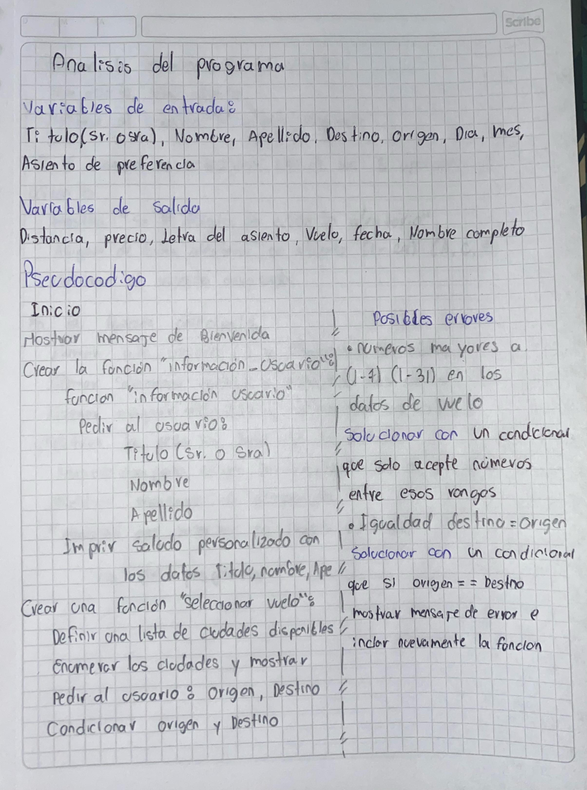
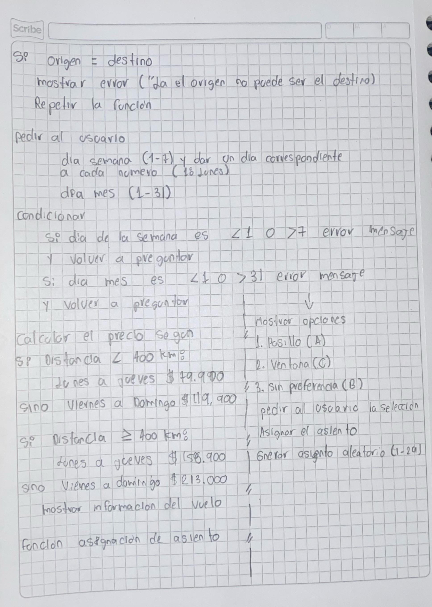
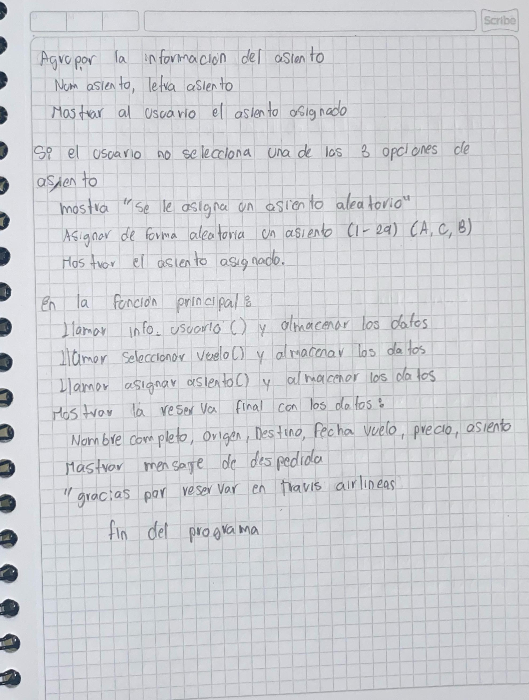

# Analisis del reto 1 "Reservas de aerolinea"

A continuacion se mostraran las imagnes de un analisis escrito de como se logro comprender y solucionar el "RETO 1" para pasar al crear el codigo de phyton:

## Pseudocodigo
    Inicio 
     Mostrar mensaje de bienvenida.
	 Solicitar información del usuario.
	 Permitir la selección de vuelo.
	 Asignar un asiento al usuario.
	 Mostrar un resumen de la reserva.
	 Finalizar el programa.

    Registro de funciones

    Función: informacion_usuario()*
	- Entrada:
		- `Titulo`: Sr. o Sra.
		- `Nombre`: Nombre del usuario.
		- `Apellido`: Apellido del usuario.
	- Proceso:
		- Mostrar un saludo personalizado.
	- Salida:
		- Retornar `Titulo`, `Nombre`, `Apellido`.

    Función: seleccionar_vuelo()
	- Entrada:
		- Lista de `ciudades` disponibles.
		- `origen`: Ciudad de origen.
		- `destino`: Ciudad de destino.
		- `dia_semana_num`: Número del día de la semana (1-7).
		- `dia_mes`: Día del mes (1-31).
	- Proceso:
		- Validar que el origen y destino sean diferentes.
		- Validar el número del día de la semana y del mes.
		- Calcular `distancia` entre las ciudades.
		- Determinar `precio` según la distancia y el día de la semana.
	- Salida:
		- Retornar `origen`, `destino`, `dia_semana`, `dia_mes`, `precio`.

    Función: asignar_asiento()
	- Entrada:
		- Preferencia de asiento (`pasillo`, `ventana`, `sin preferencia`).
	- Proceso:
		- Asignar letra del asiento según la elección.
		- Generar número de asiento aleatorio entre 1 y 29.
	- Salida:
		- Retornar el asiento asignado.

     **Ejecución del programa**
	     Llamar a `informacion_usuario()` y almacenar datos.
	    Llamar a `seleccionar_vuelo()` y almacenar datos.
	    Llamar a `asignar_asiento()` y almacenar el asiento.
	         Mostrar resumen con:
		    - Nombre completo del usuario.
		    - Datos del vuelo.
		    - Precio del billete.
	    	- Asiento asignado.
             Finalizar el programa.
    FIN

### CODIGO DE PYTHON 

Este link conduce al archivo con el codigo de python:
 [Reservas.py](./Reto_1.py)