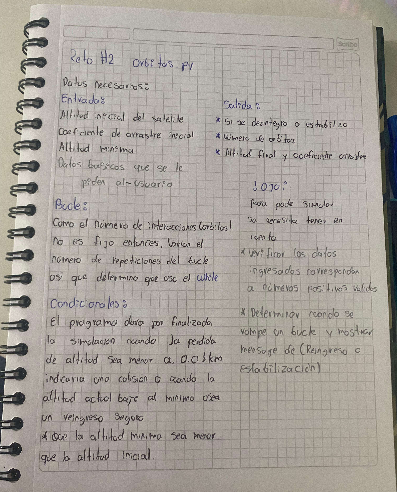

# Analisis del reto 1 "Reservas de aerolinea"

A continuacion se mostraran las imagnes de un analisis escrito de como se logro comprender y solucionar el "RETO 1" para pasar al crear el codigo de phyton:

## Pseudocodigo
    Inicio 
     Mostrar mensaje de bienvenida.
	 Solicitar información del usuario.
	 Permitir la selección de vuelo.
	 Asignar un asiento al usuario.
	 Mostrar un resumen de la reserva.
	 Finalizar el programa.

    Registro de funciones

    Función: informacion_usuario()*
	- Entrada:
		- `Titulo`: Sr. o Sra.
		- `Nombre`: Nombre del usuario.
		- `Apellido`: Apellido del usuario.
	- Proceso:
		- Mostrar un saludo personalizado.
	- Salida:
		- Retornar `Titulo`, `Nombre`, `Apellido`.

    Función: seleccionar_vuelo()
	- Entrada:
		- Lista de `ciudades` disponibles.
		- `origen`: Ciudad de origen.
		- `destino`: Ciudad de destino.
		- `dia_semana_num`: Número del día de la semana (1-7).
		- `dia_mes`: Día del mes (1-31).
	- Proceso:
		- Validar que el origen y destino sean diferentes.
		- Validar el número del día de la semana y del mes.
		- Calcular `distancia` entre las ciudades.
		- Determinar `precio` según la distancia y el día de la semana.
	- Salida:
		- Retornar `origen`, `destino`, `dia_semana`, `dia_mes`, `precio`.

    Función: asignar_asiento()
	- Entrada:
		- Preferencia de asiento (`pasillo`, `ventana`, `sin preferencia`).
	- Proceso:
		- Asignar letra del asiento según la elección.
		- Generar número de asiento aleatorio entre 1 y 29.
	- Salida:
		- Retornar el asiento asignado.

     **Ejecución del programa**
	     Llamar a `informacion_usuario()` y almacenar datos.
	    Llamar a `seleccionar_vuelo()` y almacenar datos.
	    Llamar a `asignar_asiento()` y almacenar el asiento.
	         Mostrar resumen con:
		    - Nombre completo del usuario.
		    - Datos del vuelo.
		    - Precio del billete.
	    	- Asiento asignado.
             Finalizar el programa.
    FIN

### CODIGO DE PYTHON 

Este link conduce al archivo con el codigo de python:
 [Reservas.py](./Reto_1.py)

 # RETO 2

 ### Ejercico de simulacion de satelite 

 A continuacion se mostrar un pequeño analisis de como se comprendio el ejercicio:

Enlace del video:
https://youtu.be/koybaYdF8kg

 ### Pseudocodigo
	Función sim_desintegracion_orbital(alt_inicial,coef_arrastre_inicial, alt_minima):
    -Inicializar alt_actual con alt_inicial
    -Inicializar coef_arrastre con coef_arrastre_inicial
    -Inicializar orbitas con 0

    Imprimir "Simulando la desintegración orbital..."

    Mientras Verdadero:
        
        -Calcular alt_perdida = coef_arrastre * alt_actual
        -Reducir alt_actual restando alt_perdida
        -Incrementar orbitas en 1

        # Imprimir estado de la simulación
        Imprimir "Órbita {orbitas}: Altitud actual = {alt_actual} km, Coeficiente de arrastre = {coef_arrastre}"

        Incrementar coef_arrastre en 0.0001

        Si alt_actual < alt_minima:
            -Imprimir "El satélite ha reingresado en la atmósfera -terrestre después de {orbitas} órbitas."
            -Imprimir "Altitud final: {alt_actual} km"
            -Romper el ciclo
			
			(estabilización)
        Si alt_perdida < 0.01:
            -Imprimir "El satélite se ha estabilizado en una órbita -baja después de {orbitas} órbitas."
            -Imprimir "Altitud final: {alt_actual} km"
            -Romper el ciclo

		Función main():
    	-Imprimir "Simulación de desintegración orbital de un satélite"

    -Solicitar alt_inicial_texto desde "Ingrese la altitud inicial -del satélite (en kilómetros):"
    -Solicitar coef_arrastre_texto desde "Introduzca el coeficiente de arrastre inicial (ej. 0.01):"
    -Solicitar alt_minima_texto desde "Ingrese la altitud mínima segura (en kilómetros):"

    Si alt_inicial_texto es un número positivo y coef_arrastre_texto es un número positivo y alt_minima_texto es un número positivo:
        -Convertir alt_inicial_texto a float
        -Convertir coef_arrastre_texto a float
        -Convertir alt_minima_texto a float

        Si alt_inicial <= 0:
            -Imprimir "La altitud inicial debe ser mayor que cero."
            -Regresar
        Si coef_arrastre_inicial <= 0:
            -Imprimir "El coeficiente de arrastre debe ser mayor que cero."
            -Regresar
        Si alt_minima <= 0:
            -Imprimir "La altitud mínima debe ser mayor que cero."
            -Regresar
        Si alt_minima >= alt_inicial:
            -Imprimir "La altitud mínima debe ser menor que la altitud inicial."
            -Regresar

        -Llamar a sim_desintegracion_orbital con alt_inicial, coef_arrastre_inicial, alt_minima

    Sino:
        -Imprimir "Entrada inválida. Asegúrate de escribir solo números."

		Llamar a main()

